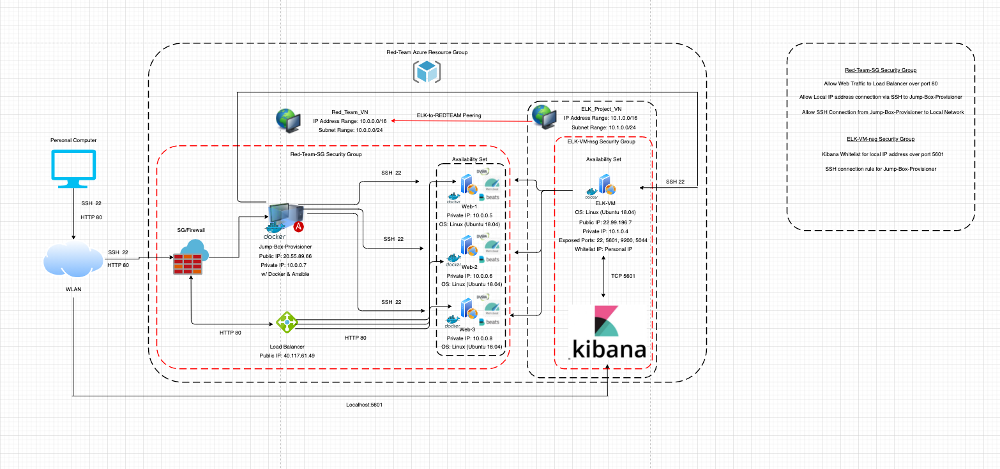

## Automated ELK Stack Deployment

The files in this repository were used to configure the network depicted below.

These files have been tested and used to generate a live ELK deployment on Azure. They can be used to either recreate the entire deployment pictured above. Alternatively, select portions of the install-elk.yml file may be used to install only certain pieces of it, such as Filebeat.

  - 

This document contains the following details:
- Description of the Topology
- Access Policies
- ELK Configuration
  - Beats in Use
  - Machines Being Monitored
- How to Use the Ansible Build

### Description of the Topology

The main purpose of this network is to expose a load-balanced and monitored instance of DVWA, the D*mn Vulnerable Web Application.

Load balancing ensures that the application will be highly available, in addition to restricting access to the network from unwanted guests.

Load balancers protect the availability of a given network by providing a website an external IP address that is accessed by the internet. The Load balancer will then distribute incoming traffic evenly accross multiple servers which can help mitigate DoS (Denial of Service) attacks. A load balancer will typically have a health probe function that will regularly check available machines to ensure they are functioning correctly before sending traffic to them. If there is a problem with a given machine, the load balancer will stop sending traffic to the machine and will issue a reported error. This will not completely protect a system, but will add to it's resiliancy.   

Integrating an ELK server allows users to easily monitor the vulnerable VMs for changes to the event logs and system metrics.

- _What does Filebeat watch for?_

FileBeat collects logs about the file system.

- _What does Metricbeat record?_

Metricbeat collects machine metrics such as uptime.

The configuration details of each machine may be found below.

| Name     | Function   | IP Address | Operating System |
|----------|------------|------------|------------------|
| Jump Box | Gateway    | 10.0.0.7   | Linux            |
| Web-1    | Web Server | 10.0.0.5   | Linux            |
| Web-2    | Web Server | 10.0.0.6   | Linux            |
| Web-3    | Web Server | 10.0.0.8   | Linux            |
| ELK-VM   | Log Server | 10.1.0.4   | Linux            |

### Access Policies

The machines on the internal network are not exposed to the public Internet. 

Only the Load Balancer can accept connections from the Internet. Access to this machine is only allowed from the following IP addresses:

- Whitelisted IP Address: Personal IP

Machines within the network can only be accessed by the Jump-Box-Provisioner utilizing docker.

The Jump-Box-Provisioner Machine is allowed to access the ELK-VM through the docker container. However, my personal computer is allowed to connect to Kibana through the web browser on port 5601.

A summary of the access policies in place can be found in the table below.

| Name          | Publicly Accessible | Allowed IP Addresses |
|---------------|---------------------|----------------------|
| Load Balancer | Yes                 | Personal/Open        |
| Jump Box      | Yes                 | Personal             |
| Web-1         | No                  | 10.0.0.7             |
| Web-2         | No                  | 10.0.0.7             |
| Web-3         | No                  | 10.0.0.7             |
| ELK-VM        | Yes                 | 10.0.0.{8,7,5,6}/Open|

### Elk Configuration

Ansible was used to automate configuration of the ELK machine. No configuration was performed manually, which is advantageous because any network administrator can implement these changes/additions across multiple machines within a given network. They can modify the playbook to their specific needs before deployment which allows this method to be scalable, repeatable, and empiracle. When a particular piece of infrastructure is needed, all that is needed in the future is the code that defines that particular item and deployment will be simple. This will also allow for security protocols to be be built from the ground up and allow for simple logging and version control. Ultimately, the main purpose of this infrastructure is to allow for Continuous Integration/Continuous Deployment '(CI/CD)' of our virtual environment through updates to our configuration files rather than one-to-one machine interaction/maintenance.  

- _What is the main advantage of automating configuration with Ansible?_

The playbook implements the following tasks:
- Increases the Virtual Memory of the Machne
- Commands the System to utilize the Increase in Memory
- Installs and Enables Docker 
- Installs Python and Enables it's Docker Module
- Initiates the ELK Stack Docker Container on Reboot 

The following screenshot displays the result of running `docker ps` after successfully configuring the ELK instance.

### Target Machines & Beats
This ELK server is configured to monitor the following machines:
- Web-1 10.0.0.5
- Web-2 10.0.0.6
- Web-3 10.0.0.8

We have installed the following Beats on these machines:
- Filebeat
- MetricBeat

These Beats allow us to collect the following information from each machine:

- Filebeat organizes log information pertaining to the file system on a given machine and sends the results to Logstash and Elasticsearch. This allows us to reduce the amount of logs pulled and monitor specifically when files are changed.
  - Example: agent.type: filebeat log.file.path: /var/log/syslog

- MetricBeat organizes log information pertaining to the machine metrics and sends the results to Logstash and Elasticsearch. This allows us to further understand how much work the machines are doing and monitor/prevent instances in which excessive CPU usage may become an issue.
  - Example: service.type: Docker service.address: /var/run/docker.sock 

### Using the Playbook
In order to use the playbook, you will need to have an Ansible control node already configured. Assuming you have such a control node provisioned: 

SSH into the control node and follow the steps below:
- Copy the install-elk.yml file to the /etc/ansible/ directory where you are currently running the ansible container.
- Update the install-elk.yml file to reflect the hosts you would like to be effected by the playbook (ensure your ansible.cfg file is updated with the correct IP addresses of the hosts you want to effect)
- Run the playbook with the ansible-playbook install-elk.yml command, and navigate to [your_elk_server_ip:5601] in your prefered web browser to check that the installation worked as expected.
- For Filebeat and Metricbeat, you will need a separate playbook and configuration file shown here:
  - 
  - 
  - 
  - 

The following screenshot shows a successful deployment of the ELK stack to your ELK server IP:

- _Which file is the playbook? Where do you copy it?_

filebeat-playbook.yml is the playbook necessary to install filebeat and should be copied to the /etc/filebeat directory on each individual machine you would like to monitor (this is provided in the filebeat-playbook.yml already)

metricbeat-playbook.yml is the playbook necessary to install metricbeat and should be copied to the /etc/metricbeat directory on each individual machine you would like to monitor (this is provided in the metricbeat-playbook.yml already)

- _Which file do you update to make Ansible run the playbook on a specific machine? How do I specify which machine to install the ELK server on versus which to install Filebeat on?_

Edit the /etc/ansible/hosts file to add web server and elk server ip addresses. In this file, you will create groups that can be updated to reflect which machines you want to install filebeat/metricbeat on specifically.
 - Ex: [webservers]
       10.0.0.4 ansible_python_interpreter=/usr/bin/python3

- _Which URL do you navigate to in order to check that the ELK server is running?_

When you have successfully run the playbook, navigate to http//:[your_elk_server_ip:5601]/app/kibana and:

- Navigate to the filebeat/metricbeat installation page
- Navigate to Step 5: Module status at the bottom of the page
- Click "Check Data" to see if Data was successfully recieved 

_As a **Bonus**, provide the specific commands the user will need to run to download the playbook, update the files, etc._
